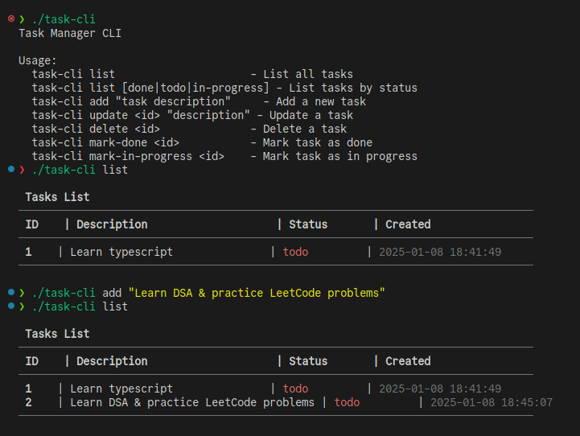

# CLI Task Manager

A command-line task management tool that helps you organize and track your tasks. It provides straightforward commands for adding, removing, updating, and listing tasks, with support for different task statuses. All tasks are automatically saved to a JSON file for data persistence.

## Features

- Create new tasks with descriptions (automatically set to "todo" status)
- Remove tasks using their ID
- Update task descriptions and statuses
- List all tasks with their current status
- Filter tasks by status (todo, in-progress, done)
- Automatic saving to a JSON file

## Use Cases

- Use it to keep track of your personal tasks and to-do lists
- Use it to manage tasks for a team project or a group assignment
- Use it to organize your daily tasks and prioritize them based on their status

## Installation

1. Make sure you have [Deno](https://deno.land/) installed
2. Install the CLI globally using:

```bash
deno install -A -f -n task-cli src/main.ts
```

3. The `task-cli` command will now be available in your terminal

## Usage

### Add a new task

New tasks are automatically created with a "todo" status. The status cannot be set during creation.

```bash
task-cli add "Task description"
```

### List all tasks

```bash
task-cli list
task-cli list --status=in-progress
```

### Update a task

```bash
task-cli update <task-id> "New description"
```

### Remove a task

```bash
task-cli remove <task-id>
```

All changes are automatically saved to the tasks.json file.

## Contributing

Contributions are welcome! If you find a bug or have a feature request, please
open an issue. If you would like to contribute code, please open a pull request.

## License

This project is licensed under the MIT License.

---
